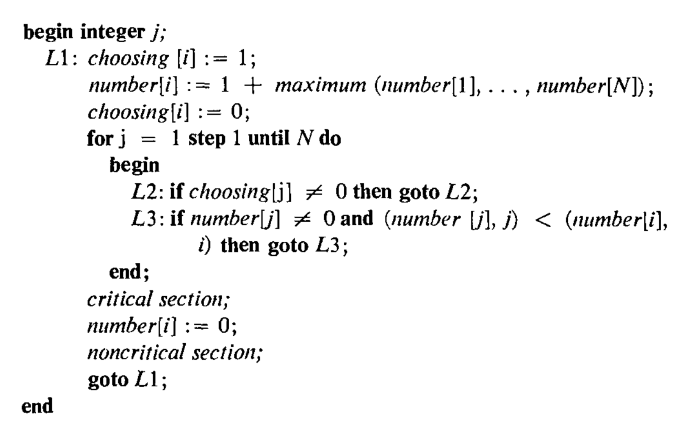
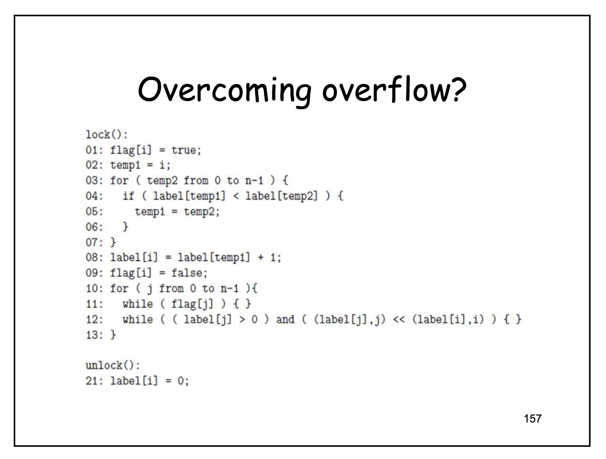

#### TL;DR
**TLA+ and Owicki-Gries analysis of a variant of Lamport's Bakery algorithm that mitigates integer overflow**.\
Starting from a flawed variant of the Bakery algorithm that doesn't ensure mutual exclusion, a further variant is proposed and formally shown to guarantee:
- mutual exclusion (main focus of the demonstration) {to_verify}
- deadlock freedom {to_verify}
- first-come, first-served {to_verify}

---

In 1974, Leslie Lamport published an article called *A New Solution of Dijkstra's Concurrent Programming Problem*[^1], where he proposed an algorithm to handle mutual exclusion between «$N$ *processors*» , that «*allows the system to continue to operate despite the failure of any individual component*» and «*is a first-come-first-served method*».

> *When a processor wants to enter its critical section, it first executes a loop-free block of code &ndash; i.e. one with a fixed number of execution steps. It is then guaranteed to enter its critical section before any other processor which later requests service.*

*Lamport's Bakery algorithm &mdash; Communications of the ACM, 17(8), August 1974, pp. 453–455.*

> Consider $N$ asynchronous computers communicating with each other only via shared memory. Each computer runs a cyclic program with two parts &ndash; a *critical section* and a *noncritical section*. 
>
> [...] the following conditions are satisfied:
> 1. At any time, at most one computer may be in its critical section.
> 2. Each computer must eventually be able to enter its critical section (unless it halts).
> 3. Any computer may halt in its noncritical section.
> 
> Moreover, no assumptions can be made about the running speeds of the computers.
>
> [...]
>
> The relation "less than" on ordered pairs of integers is defined by $(a,b) \lt (c,d) \texttt{ if } a \lt c, \texttt{ or if } a=c \texttt{ and } b < d$. 

\
*Throughout this document, the comparison of ordered pairs will also be referred to as lexicographical ordering or tie-breaking rule.*

---

As stated by Lamport himself in the *Further Remarks* section:

> If there is always at least one processor in the bakery, then the value of $number[i]$ can become arbitrarily large.
> 
> This problem cannot be solved by any simple scheme of cycling through a finite set of integers.

Even though «practical considerations will place an upper bound on the value of $number[i]$ in any real application» various attempts were made to address the issue of integer overflow.

The following algorithm, here called *Overcoming Overflow* algorithm (OO), is one such attempt.

*The Overcoming Overflow algorithm attempts to prevent integer overflow in Lamport's Bakery algorithm, but introduces a major bug: **it does not ensure mutual exclusion**.*

### Counterexample: Overcoming Overflow algorithm does not ensure mutual exclusion

//TODO

## Variant of the Overcoming Overflow algorithm
The proposed variant, denoted $\mathrm{OO}'$, differs from the original algorithm $\mathrm{OO}$ in a single line: the comparison at line 04 is replaced by

$$
\texttt{label[temp1]} \leq \texttt{label[temp2]}.
$$

That is, $\leq$ is used instead of $\lt$.

**Motivation.** In $\mathrm{OO}$, the doorway and the waiting room break ties between equal labels in opposite directions. Let $\prec_w$ be the order used in the waiting room (line 12):

$$
(a, b) \prec_w (c, d) \iff a < c \,\lor\, (a = c \land b < d).
$$

Under $\prec_w$, among processes holding equal labels, the one with the largest index is the *last* to enter the critical section. The scan at lines 03-07 is intended to select the maximum element under this order, but with the strict inequality at line 04 it implicitly maximizes with respect to a different order,

$$
(a, b) \prec_d (c, d) \iff a < c \,\lor\, (a = c \land b > d),
$$

whose tie-breaker on the index is reversed.

**Tie-breaking in the doorway.** Let $m = \max_k \texttt{label[}k\texttt{]}$ be the maximum label observed by the scan at lines 03-07, and let $M = \{k \mid \texttt{label[}k\texttt{]} = m\}$. In $\mathrm{OO}$, the strict comparison at line 04 updates $\texttt{temp1}$ only when a strictly larger label is found. Hence, for $m > 0$, the scan returns $\min M$, the *first* occurrence of the maximum. For example, on the labels $(2, 4, 1, 5, 2, 5)$ it returns index 3. For $m = 0$, no update ever occurs and the scan returns $i$, the index of the calling process, which belongs to $M$ but is in general neither $\min M$ nor $\max M$. In $\mathrm{OO}'$, the update also occurs on equality, so the scan returns $\max M$, the *last* occurrence of the maximum, for every value of $m$ (index 5 in the example, and $n-1$ when $m = 0$).

In the waiting room, by contrast, line 12 orders processes with equal labels by increasing index, so the process with index $\max M$ is the *last* to be served among those in $M$. The doorway of $\mathrm{OO}$ therefore selects as reference the element of $M$ that the waiting room serves *first*, whereas the doorway of $\mathrm{OO}'$ selects the one it serves *last*, which is the maximum under the waiting-room order.

**The following section will demonstrate that such simple edit will garantee mutual exclusion**.

---

# References

[^1]: [Leslie Lamport, “A New Solution of Dijkstra’s Concurrent Programming Problem,” Communications of the ACM, 17(8), August 1974, pp. 453–455](https://dl.acm.org/doi/epdf/10.1145/361082.361093)

---

# TODO
- One thing to make explicit: why the identity of the selected process matters and not just its label value. Since line 08 re-reads label[temp1], the value can differ from the one seen at line 04 if process temp1 changes its label in between. Since that is the argument for the failure of $\mathrm{OO}$, it deserves its own sentence, ideally followed by the interleaving trace.